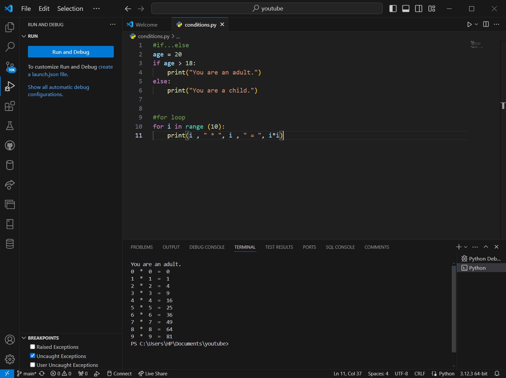

# SE-Assignment-6
 Assignment: Introduction to Python
Instructions:
Answer the following questions based on your understanding of Python programming. Provide detailed explanations and examples where appropriate.

 Questions:

1. Python Basics:
   - What is Python, and what are some of its key features that make it popular among developers? Provide examples of use cases where Python is particularly effective.
    - Python is an object-oriented, high-level programming language. It is used for web development (server-side), software development and system scripting.
    - Features: Python works on different platforms, it has a simple syntax similar to the English language, it has syntax that allows developers to write programs with fewer lines than some other programming languages, it runs on an interpreter system, meaning that code can be executed as soon as it is written.
    - It is used for web development (server-side), software development and system scripting.

2. Installing Python:
   - Describe the steps to install Python on your operating system (Windows, macOS, or Linux). Include how to verify the installation and set up a virtual environment.
    - Download Python: Visit the official Python website at https://www.python.org/downloads and click on the "Downloads" tab. Choose the version that suits your operating system and download the installer.
    - Run the downloaded executable file. Check the box that says "Add Python to PATH" during installation to make it easier to run Python from the command line.
    - Verify Installation: Open a command prompt or terminal and type: python --version, You should see the installed Python version.
    - Integrated Development Environment (IDE): You can use a text editor (like VSCode) for writing and running Python code.
    - Python comes with a package manager called pip. You can use it to install external libraries. To upgrade pip, run: pip install --upgrade pip.
    And you are ready to code using python.

3. Python Syntax and Semantics:
   - Write a simple Python program that prints "Hello, World!" to the console. Explain the basic syntax elements used in the program.
    
    - Print command is used to display content on the terminal. "" are used to displayy text.

4. Data Types and Variables:
   - List and describe the basic data types in Python. Write a short script that demonstrates how to create and use variables of different data types.
    - Integer(int) - Represents whole numbers without any decimal point.
    - Float (float): Represents real numbers with a decimal point.
    - String (str): Represents sequences of characters, enclosed within single quotes (' ') or double quotes (" ").
    - Boolean (bool): Represents truth values True and False.
    - NoneType (None): Represents the absence of a value or a null value.
   

5. Control Structures:
   - Explain the use of conditional statements and loops in Python. Provide examples of an `if-else` statement and a `for` loop.
    - Conditional statements allow you to execute certain pieces of code based on the evaluation of a condition. Loops are used to repeat a block of code multiple times until a certain condition is met.
   

6. Functions in Python:
   - What are functions in Python, and why are they useful? Write a Python function that takes two arguments and returns their sum. Include an example of how to call this function.
    - A function is a block of code which only runs when it is called. It is a block of reusable code that perform a specific task. It is useful because it is reusable, allows modularity and provides a level of abstraction.
    

7. Lists and Dictionaries:
   - Describe the differences between lists and dictionaries in Python. Write a script that creates a list of numbers and a dictionary with some key-value pairs, then demonstrates basic operations on both.
    - A list is an ordered collection of items, it can contain elements of different data types, including integers, floats, strings, and even other lists while a dictionary is an unordered collection of key-value pairs, ach key-value pair maps the key to its corresponding value.
    - Lists are created using square brackets [] while dictionaries are created using curly brackets {}
    

8. Exception Handling:
   - What is exception handling in Python? Provide an example of how to use `try`, `except`, and `finally` blocks to handle errors in a Python script.
    - When an error occurs, Python will normally stop and generate an error message. This errors(exceptions) are handled using different scripts. It allows you to gracefully manage and respond to errors that occur during the execution of a program.
    - By using 'try', 'except', and 'finally' blocks, you can control how your program reacts to these exceptions, ensuring it handles them in an appropriate manner. 
    

9. Modules and Packages:
   - Explain the concepts of modules and packages in Python. How can you import and use a module in your script? Provide an example using the `math` module.
    - A module in Python is a single file containing Python code that defines functions, classes, and variables. It serves as a way to organize related code into a separate file for better modularity. A package in Python is a collection of modules (and subpackages) organized in a directory structure.
    - You can import a module by using the 'import' keyword followed by the module name at the top of your file. You use the module by using a keyword found in that imported module in your code.
    

10. File I/O:
    - How do you read from and write to files in Python? Write a script that reads the content of a file and prints it to the console, and another script that writes a list of strings to a file.
     - Reading from and writing to files in Python involves using built-in functions and methods provided by the open() function and file objects. It involves displaying the contents of other files using python.
     

# Submission Guidelines:
- Your answers should be well-structured, concise, and to the point.
- Provide code snippets or complete scripts where applicable.
- Cite any references or sources you use in your answers.
- Submit your completed assignment by [due date].

